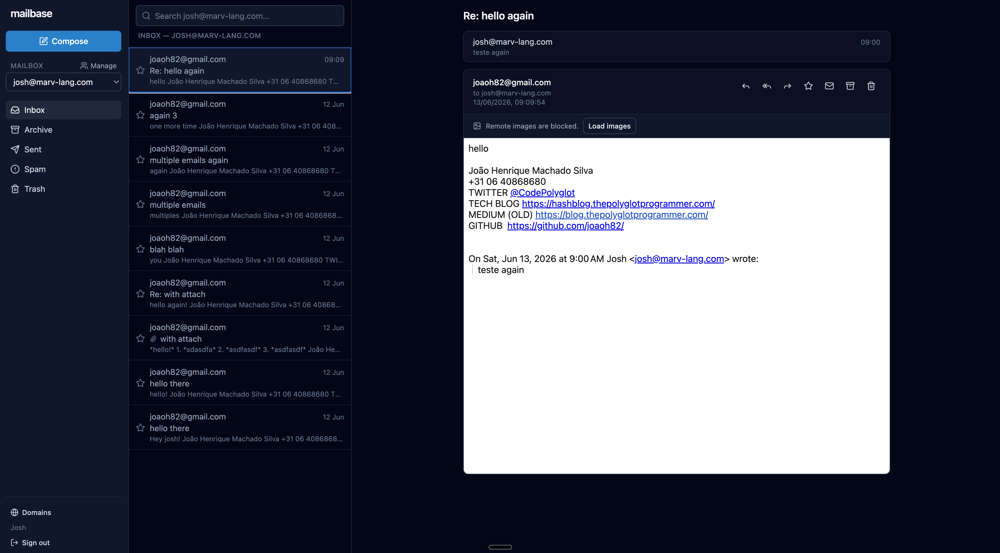
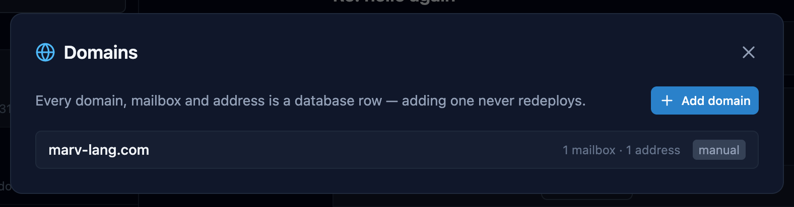
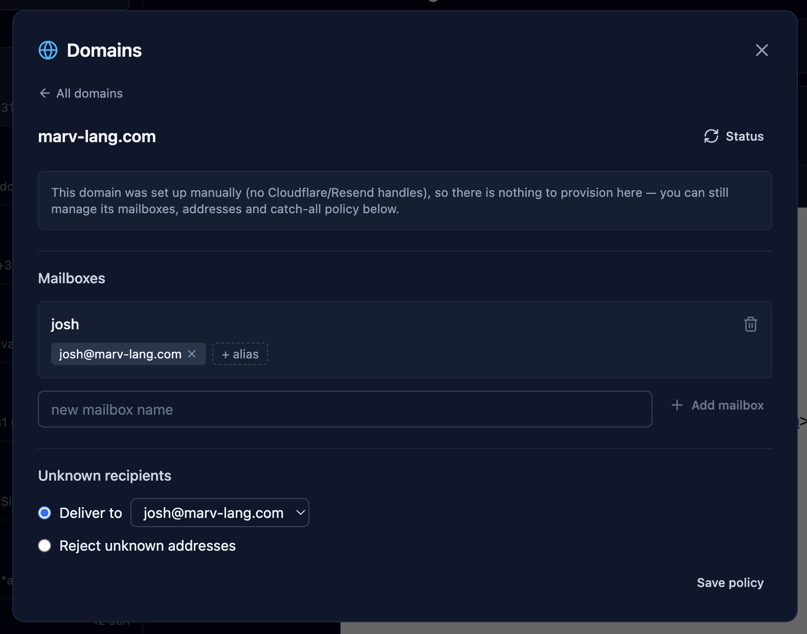

<div align="center">
  <a href="images/mailbase-demo.mp4">
    
  </a>
  <p><em>▶ 45-second demo — receive, read, and add a domain. Click for full-quality video.</em></p>
</div>

<!--
  The GIF above autoplays muted in the README. For a true autoplaying <video>
  (best quality), drag images/mailbase-demo.mp4 into a GitHub issue or comment to get a
  user-images.githubusercontent.com URL, then swap the block above for that .mp4 link on
  its own line. The MP4/WebM/poster are committed under images/ either way.
-->


# mailbase

[](https://github.com/joaoh82/mailbase/actions/workflows/ci.yml)
[](https://github.com/joaoh82/mailbase/commits/main)
[](LICENSE)
[](tsconfig.json)
[](https://workers.cloudflare.com/)
[](#contributing)

**Stop paying for enterprise email on every domain — self-host them all for $0–5/month.**

Self-hosted, multi-domain, multi-account webmail on Cloudflare's developer platform.
One deployment serves every domain — domains, mailboxes, and users are database rows,
never infrastructure. Runs for ~$0–5/month at personal/small-team volume.

> **Early development.** The full send/receive loop works end-to-end across multiple
> users and domains (Phases 0–5); production hardening (Phase 6) is next. See the
> [roadmap](docs/ROADMAP.md).

## Screenshots

A three-pane React webmail — folders, threaded conversations, search, and an
account/mailbox switcher. HTML renders in a sandboxed iframe with remote images blocked
until you opt in.



Domains are data, not infrastructure — an admin adds and manages them from the UI, and
adding one never redeploys:

| Every domain is a database row | Manage mailboxes, aliases & policy |
| --- | --- |
|  |  |

## Features

What works today (Phases 0–5 — see the [roadmap](docs/ROADMAP.md) for what's next):

- **Receive on unlimited domains.** Cloudflare Email Routing → an Email Worker parses
  with `postal-mime`, stores the raw `.eml` in R2 (the source of truth) and parsed
  metadata in D1, threads the message, and indexes it for search.
- **Read in a webmail.** Three-pane inbox with folders (Inbox / Archive / Sent / Spam /
  Trash), a virtualized message list, threaded conversations, read/unread, star, and
  archive/trash. Full-text search via SQLite FTS5. HTML mail renders in a **sandboxed
  iframe with remote images blocked by default**; attachments download through signed,
  expiring URLs.
- **Send via Resend.** A rich-text composer (bold, italic, bullet & numbered lists,
  headings, links) that sends real HTML email with a plaintext fallback, plus reply /
  reply-all / forward with quoting, and attachments. **Signatures** are auto-appended to
  outgoing mail — set one per send-as address, with a per-mailbox default as fallback;
  switching the From address swaps the signature in place. Outbound HTML is sanitized to a
  safe allowlist on the way out. Sent mail goes out behind the `MailSender` interface, lands
  in a Sent folder, threads correctly, and bounces/complaints are flagged via webhooks.
- **Multiple users & shared inboxes.** `owner` / `member` roles, per-user send-as
  enforcement (you can only send from addresses you belong to), an account switcher, and
  one-time **invite links** to onboard new accounts.
- **Multi-domain, all from the UI.** Admins add a domain and mailbase drives the
  Cloudflare API (create the zone, enable Email Routing, point the catch-all at the email
  worker) and the Resend API (register the domain, write DKIM/SPF records), then shows
  live verification status. A domain switcher and a unified **"all inboxes"** view round
  it out. The only manual step is delegating nameservers at your registrar — which the UI
  spells out.

## How it works

```
Internet (SMTP) → Cloudflare Email Routing → Email Worker → R2 (raw .eml) + D1 (metadata)
                                                                  ↑
React SPA (webmail) ←——— HTTPS/JSON ———→ API Worker (Hono) ———————┘
                                              ↓
                                           Resend (outbound)
```

- **Raw email is the source of truth** — full RFC 5322 messages live in R2; D1 holds
  parsed metadata and full-text search (SQLite FTS5), and is re-buildable from R2.
- **Domains and accounts are data** — adding a domain or mailbox never touches code.
- **Web client first** — no IMAP/SMTP server; see [docs/DESIGN.md](docs/DESIGN.md) for
  architecture, data model, and core flows.

## Repository layout

```
packages/email-worker/   # inbound Email Routing handler
packages/api/            # Hono REST API, auth, send
packages/web/            # React SPA (Vite + Tailwind)
packages/shared/         # types, Drizzle schema, MailSender interface
migrations/              # D1 SQL migrations (numbered, append-only)
marketing/               # Remotion source for the README demo video (standalone)
docs/                    # DESIGN.md, SELF_HOSTING.md, ROADMAP.md, PROMPTS.md
```

## Documentation

- **[docs/DESIGN.md](docs/DESIGN.md)** — architecture, data model, core flows, and the
  detailed development plan. The source of truth; read it before non-trivial changes.
- **[docs/SELF_HOSTING.md](docs/SELF_HOSTING.md)** — the full, step-by-step guide to
  running your own mailbase on your own Cloudflare account.
- **[docs/ROADMAP.md](docs/ROADMAP.md)** — what's shipped, what's in progress, and what's
  under consideration.
- **[docs/PROMPTS.md](docs/PROMPTS.md)** — the phase-by-phase prompts used to build the
  project with Claude Code.

## Host your own

mailbase is built to be self-hosted on your own Cloudflare account. The full
walkthrough — account prerequisites, creating the D1 database and R2 bucket,
pointing a domain, deploying, and wiring up CI — lives in
**[docs/SELF_HOSTING.md](docs/SELF_HOSTING.md)**.

You'll need: a [Cloudflare account](https://dash.cloudflare.com/sign-up) (the **Workers
Paid plan, $5/mo, is required from Phase 2** — argon2id login exceeds the free plan's
10ms CPU limit), [Node.js](https://nodejs.org/) 22+ (an `.nvmrc` pins Node 24 — run
`nvm use` to match), a domain you control for receiving mail, and a
[Resend](https://resend.com) account for sending.

The short version:

```sh
git clone https://github.com/joaoh82/mailbase && cd mailbase
nvm use               # match the pinned Node 24 (.nvmrc)
make install          # npm install across workspaces
npx wrangler login
make setup            # creates the D1 database + R2 bucket (one-time)
# paste your database_id into the three wrangler.jsonc files (see guide)
make migrate-remote   # apply the schema to your D1 database
make deploy           # deploy all three workers
```

Then point a domain at Cloudflare, seed a domain/mailbox/user, and enable sending — all
covered in the guide.

## Developing

| Command              | What it does                                            |
| -------------------- | ------------------------------------------------------- |
| `make install`       | Install all workspace dependencies                      |
| `make dev`           | Run the API worker locally (Miniflare D1/R2 bindings)   |
| `make dev-web`       | Run the web SPA dev server (Vite, port 5173)            |
| `make test`          | Vitest across all workspaces (Workers runtime via Miniflare) |
| `make typecheck`     | `tsc --noEmit` across all workspaces                    |
| `make migrate-local` | Apply D1 migrations to the local dev database           |
| `make seed-local DOMAIN=…` | Seed a domain/mailbox/addresses into the local dev database |
| `make user-local EMAIL=… PASSWORD=…` | Create/update a webmail login in the local dev database |
| `make build`         | Build the web SPA                                       |

Run `make help` to list every target with its underlying command.

For local webmail: run `make dev` (API on :8787) and `make dev-web` (Vite on :5173)
side by side — Vite proxies `/api` to the API worker, mirroring production where the
web worker forwards `/api/*` to `mailbase-api` over a service binding. Copy
`packages/api/.dev.vars.example` to `packages/api/.dev.vars` first (attachment URL
signing key). The full local-dev loop (migrate, seed, create a user) is in
[docs/SELF_HOSTING.md → Local development](docs/SELF_HOSTING.md#local-development).

## Contributing

Issues and pull requests are welcome. mailbase is long-lived personal infrastructure, so
the bar is **boring, readable, well-tested code over clever abstractions**.

- Read [docs/DESIGN.md](docs/DESIGN.md) before non-trivial work — it's the source of truth
  for architecture and the data model. If a change contradicts it, update DESIGN.md in the
  same PR.
- `make typecheck` and `make test` must pass before a PR; CI enforces both.
- Keep small, per-feature commits with imperative subject lines.

See [CLAUDE.md](CLAUDE.md) for the full conventions.

## License

[MIT](LICENSE)
